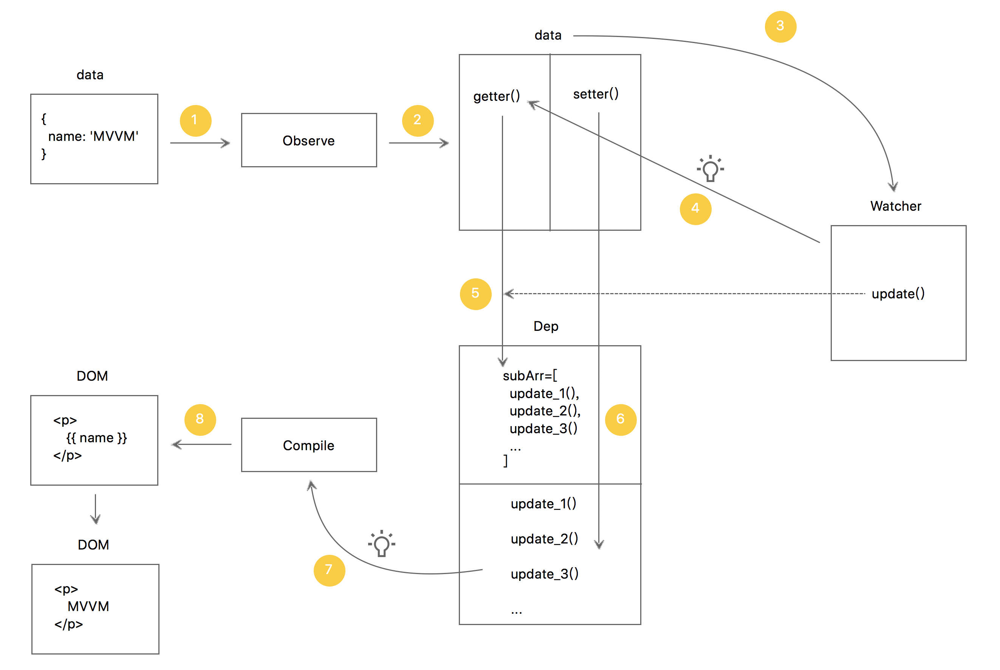

1. 原生data经过Observe递归改造。

2. Observe会为data所有属性添加getter/setter，变成observableData。

3. observableData传入Watcher。

4. Watcher内部会触发observableData的getter。

5. 这个getter会把当前的Watcher实例（特指watcher当中的update()函数）放入Dep的数组中，完成事件的订阅。

6. 当observableData被修改，会触发setter()，setter()会触发Dep内部被订阅的事件函数。

7. 被订阅的事件函数，也就是Watcher实例内的update()函数，会带着新值触发Compile对DOM进行渲染。

8. DOM完成渲染。

参考链接：

https://juejin.im/post/5abdd6f6f265da23793c4458

https://juejin.im/post/5acc17cb51882555745a03f8